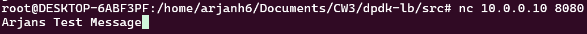
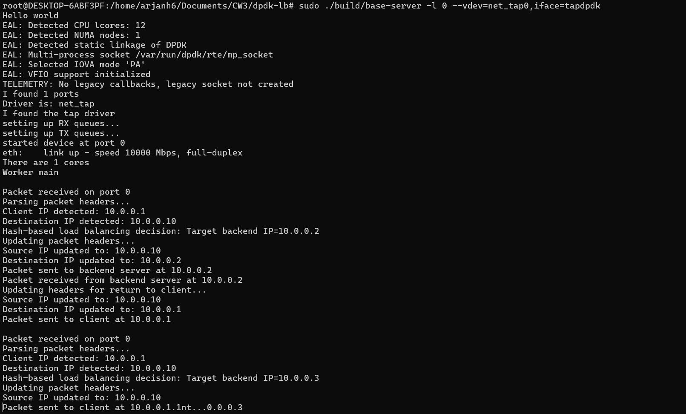

# **Load Balancer Implementation Report**

## Description of the Process

The load balancer listens for incoming TCP packets on the virtual interface at `10.0.0.10`. It selects one of the two backend servers (`10.0.0.2` and `10.0.0.3`) based on a hash of the packet's 5-tuple (source IP, destination IP, source port, destination port, and protocol). It modifies the source IP to `10.0.0.10` (load balancer's IP) and forwards the packet to the chosen backend.

When the backend responds, the load balancer modifies the source IP and MAC to `10.0.0.10` and the destination IP to the client (`10.0.0.1`). This ensures seamless communication between the client and backend servers.

---

## Client and Server Interaction

